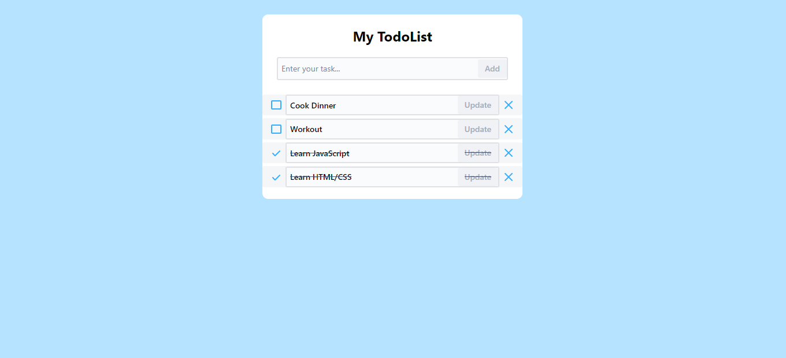

# Web demo Todo App

This project is for building and customizing your todo-list.

## Demo

  

Link demo: [https://nguyenmht.github.io/demo-todo-app/](https://nguyenmht.github.io/demo-todo-app/).

## Technology used 

- HTML/CSS
- JavaScript
- ReactJS
- Some library of ReactJS: Atlaskit, styled-components, uuid,...

### Functions

- CRUD task: create, read, update, delete task
- Local storage: your task will not be deleted when you reload the page

## User mannual
### Create task
- Enter the content of the task you want to add in the first field
- Press Add button or Enter key to add

### Read task
- After adding, your task will be displayed in the list below

### Check complete task
- Click the box button before the task to mark it completed
- Click the check button before the task to mark it incompleted

### Update task
- Enter the new content of the task you want to update in its field
- Press Update button or Enter key to update your task

### Delete task
- Click the cross button at the end of the line of the task you want to delete

## Future funcion
- Improve UI/UX
- Drag/Drop to update task status
